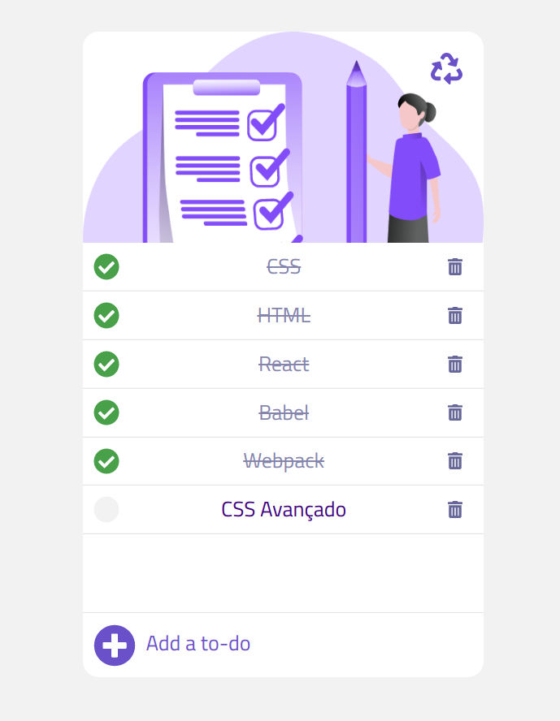

# 01 - Projeto de Todo List

Iniciativa de 1 projeto por dia ou por ciclo.

### Tecnologias usadas:
- [ReactJs](https://pt-br.reactjs.org/)
- [Babel](https://babeljs.io/)
- [Webpack](https://webpack.js.org/)

_Data de execução:_
2020-04-12

### Preparando o ambiente
**01: dependencies**
```bash 
yarn add
react
react-dom
@babel/core
@babel/preset-env
@babel/preset-react
@babel/cli
webpack
webpack-cli
babel-loader
style-loader
css-loader
file-loader
```

**02: dev-dependencies**
```bash
yarn add -D
webpack-dev-server
```

**03: folders**
```bash
mkdir
src
src/components
public
```

**04: files**
```bash
touch
public/index.html
src/index.js
src/components/App.js
babel.config.js
webpack.config.js
```

**05: config files**
_babel.config.js_
```js
module.exports = {
  presets: [
    "@babel/preset-env",
    "@babel/preset-react"
  ],
}
```

_webpack.config.js_
```js
const path = require("path");
module.exports = {
  entry: path.resolve(__dirname, "src", "index.js"),
  output: {
    path: path.resolve(__dirname, "public"),
    filename: "bundle.js",
  },
  devServer: {
    contentBase: path.resolve(__dirname, "public"),
  },
  module: {
    rules: [
      {
        test: /\.js$/,
        exclude: /node_modules/,
        use: {
          loader: "babel-loader",
        },
      },
      {
        test: /\.css$/,
        exclude: /node_modules/,
        use: [
          {loader: "style-loader"},
          {loader: "css-loader"},
        ]
      },
      {
        test: /\.(png|gif|jpe?g)$/,
        use: {
          loader: "file-loader"
        },
      },
    ],
  },
};
```
**06: public files**
_public/index.js_
```html
<!DOCTYPE html>
<html lang="en">
<head>
  <meta charset="UTF-8">
  <meta name="viewport" content="width=device-width, initial-scale=1.0">
  <title>01 - Todo List</title>
</head>
<body>
  <div id="app"></div>
  <script src="bundle.js"></script>
</body>
</html>
```
* o mesmo resultado pode ser alcançado com o plugin emmet do VSCode seguindo os seguintes commandos
```
// No inicio do arquivo
html:5 (enter)

// Dentro do body
div#app (enter)

// Depois da <div></div>
script:src (enter)

// lembre-se de usar src="bundle.js"
```
**07: package.json scripts**
```json
scripts: {
  "listen": "yarn webpack-dev-server --mode development"
}
```
#### Conclusão do projeto
Muitos dos estilos foram feitos dentro do componente ```List```. Provavelmente ainda tem muito para melhorar em relação a CSS e componentização. Achei o componente muito grande, mas como ainda não sei lidar com estado entre componentes, resolvi fazer desta forma.

#### Resultado

[App demo](https://akira-01-todolist.netlify.com/)



#### Possíveis melhorias
- Banco de dados ou LocalStorage
- Socket.io para compartilhar estado com outros usuários
- Salvar lista
- Compartilhar lista
- Editar lista
- Dupla verificação para DELETAR item

##### Contato
<felipe.fukue@gmail.com>